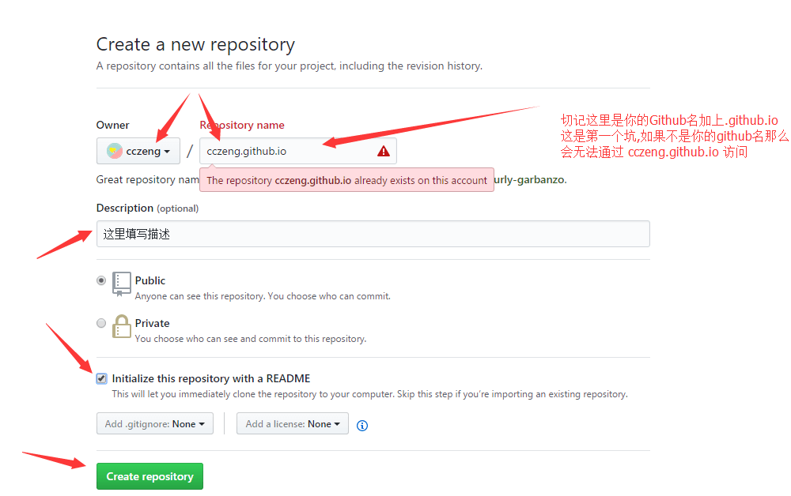

## 本文主旨

* 什么是GitHub
* 如何使用

### 什么是GitHub

前几天看到微软成功收购GitHub的新闻时，瞬间感觉虎躯一震，恭喜微软喜提[世界最大的同性交流网站](https://github.com/)!

从文字意思我们可以看出 GitHub = Git + Hub，即git中心。那什么是git呢？git是一个开源的分布式版本控制系统，也是世界上最热门的，它实现了远程管理你的本地项目。GitHub给与了一个免费的git服务器，你可以上传任何大小的项目。

### 如何使用GitHub

> GitHub的核心是一个名为Git的开源版本控制系统（VCS）。 Git负责与计算机本地发生的所有GitHub相关的事务。

1. 先去创建个账号吧。[GitHub注册页面](https://github.com/)
2. 安装git
    1. [下载对应版本的git安装包并安装](https://git-scm.com/downloads)
    2. 打开 Git Bash
    3. 设置用户名
    ```shell
    git config --global user.name "xiaoming"
    ```
    4. 设置邮箱
    ```shell
    git config --global user.email "email@example.com"
    ```
3. 创建一个仓库
登录账号后，在任何页面的右上角，单击+，然后单击新建存储库
4. 安装[GitHub Desktop](https://desktop.github.com/)，[->使用教程<-](https://help.github.com/desktop/guides/contributing-to-projects/)

## Good luck
